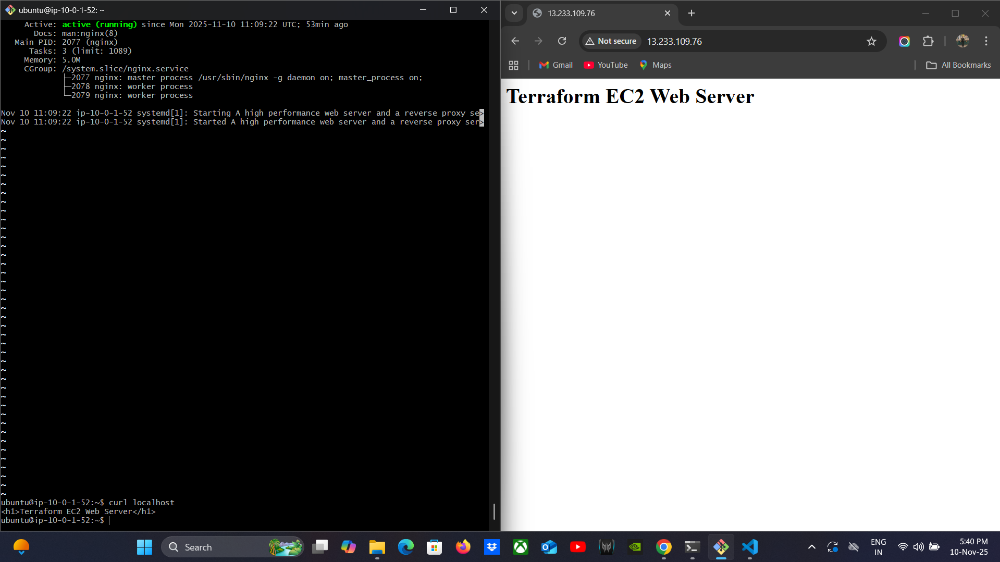

# 🚀 Terraform AWS Infrastructure Project — EC2 + RDS + Nginx

This project demonstrates an **end-to-end Infrastructure as Code (IaC)** deployment on **AWS using Terraform**, provisioning essential cloud resources automatically with minimal manual intervention.

---

## 🧩 Project Overview

This Terraform configuration automates the deployment of:

- **Amazon EC2 Instance** — Hosts an Nginx web server.
- **Amazon RDS (MySQL)** — Provides a managed relational database.
- **VPC, Subnets & Security Groups** — Ensures secure, isolated networking.
- **Automated Initialization** — Installs and configures Nginx on EC2 automatically.

---

## 🏗️ Architecture Diagram

---

## ⚙️ Key Terraform Files

| File | Purpose |
|------|----------|
| `main.tf` | Main Terraform configuration (resources, EC2, RDS, networking). |
| `provider.tf` | AWS provider configuration and authentication. |
| `variables.tf` | Stores configurable variables for modularity. |
| `outputs.tf` | Displays key resource outputs (e.g., EC2 public IP, RDS endpoint). |
| `terraform.tfvars` | Sensitive variable values (excluded via `.gitignore`). |

---

## 📸 Screenshots

| Step | Screenshot | Description |
|------|-------------|--------------|
| 1 | `01_terraform_init_success.png` | Terraform provider initialization |
| 2 | `Terraform validate success.png` | Configuration validation success |
| 3 | `02_terraform_plan.png` | Terraform plan summary |
| 4 | `03_terraform_apply_complete.png` | Apply completed successfully |
| 5 | `final_web_page.png` | Live Nginx server output |

---

## 🧠 Key Learnings

- Infrastructure as Code (IaC) principles with **Terraform**
- AWS automation for compute + database + networking
- Managing remote infrastructure declaratively
- Using `.gitignore` to secure credentials and sensitive state files
- Safe repository management for public sharing

---

## 🛡️ Security Practices

- Sensitive keys and `.tfvars` excluded via `.gitignore`
- No AWS Access Keys or secrets stored in repo
- Screenshots containing secrets excluded safely

---

## 🧰 Tech Stack

- **Terraform v1.9+**
- **AWS EC2, RDS (MySQL), VPC, Nginx**
- **Git & GitHub for version control**
- **VS Code / Git Bash** for IaC development

---

## ✨ Author

**Ajinkya Dhote**  
Cloud & AI Enthusiast | AWS + Terraform + DevOps  
🌐 [LinkedIn Profile](https://linkedin.com/in/ajinkya0771)  
📂 [GitHub Projects](https://github.com/ajinkya0771)

---

## 🏁 Final Output

**Public IP:** Displays the Nginx page:  
> “Terraform EC2 Web Server”

---

> 💡 _This project serves as a complete AWS Infrastructure deployment example — ideal for DevOps, Cloud, and IaC portfolios._
