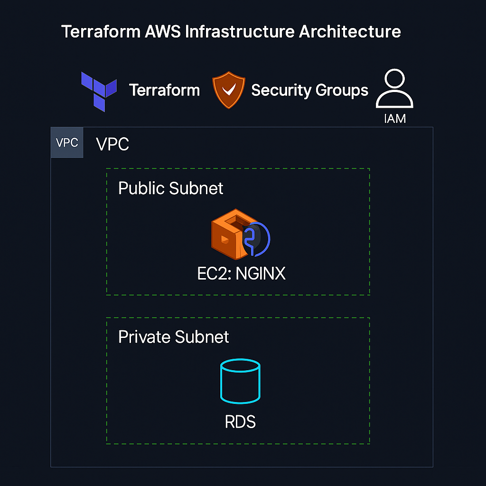

🏗️ Terraform AWS Infrastructure Project

💡 End-to-end Infrastructure as Code (IaC) deployment using Terraform to provision and configure AWS EC2, RDS, and Nginx Web Server.
This project demonstrates a complete workflow from AWS authentication to fully automated infrastructure provisioning, validation, and deployment.

📋 Project Overview

This project builds a cloud-based infrastructure on Amazon Web Services (AWS) using Terraform for automation and reproducibility.
It includes:

🖥️ EC2 instance for hosting a web server (Nginx)

🗄️ RDS MySQL database for persistent storage

🌐 Automated configuration using Terraform scripts

🔒 Security-compliant setup with all secrets redacted

🧱 Architecture Diagram

> **Diagram:** Terraform provisions a secure AWS environment with a VPC containing a public subnet (EC2 with Nginx) and a private subnet (RDS MySQL), managed by Security Groups and IAM roles — all automated via Terraform.

The architecture provisions a complete AWS environment including a public EC2 instance, private RDS database, and VPC configuration.

⚙️ Tech Stack & Tools
Category	Tool / Service
IaC	Terraform
Cloud Provider	Amazon Web Services (AWS)
Compute	EC2
Database	RDS (MySQL)
Web Server	Nginx
Version Control	Git & GitHub
IDE	Visual Studio Code
OS	Windows 11 / Git Bash
🚀 Workflow Steps
Step	Description	Screenshot
1️⃣	AWS CLI Configured & Verified	

2️⃣	Terraform Initialization Successful	

3️⃣	Terraform Configuration Validated	

4️⃣	Terraform Plan Generated	

5️⃣	Terraform Apply Completed (Resources Created)	

6️⃣	Deployed EC2 + Nginx Web Server Verified	

All screenshots are securely redacted and demonstrate a real Terraform AWS deployment lifecycle.

🪜 Terraform Commands Used
# Initialize Terraform
terraform init

# Validate configuration
terraform validate

# Generate execution plan
terraform plan -out=tfplan

# Apply infrastructure changes
terraform apply "tfplan"

# Destroy resources (when cleaning up)
terraform destroy

📂 Project Structure
terraform-aws-infra/
│
├── main.tf
├── variables.tf
├── outputs.tf
├── provider.tf
├── terraform.tfvars
├── terraform.tfstate / .backup
├── screenshots/
│   ├── 00_aws_configure_identity_redacted.png
│   ├── 01_terraform_init_success_redacted.png
│   ├── 02_terraform_plan_redacted.png
│   ├── 03_terraform_apply_complete_redacted.png
│   ├── Terraform validate success.png
│   └── final_web_page_redacted.png
└── README.md

🧩 Key Highlights

🧠 Automated provisioning of EC2 and RDS via Terraform

⚡ Reusable and parameterized configurations (variables.tf)

🔄 Clean state management and version control

🔐 Sensitive data protected with .gitignore and redactions

🧱 Modular, production-ready IaC setup

🧹 Security & Compliance

All AWS credentials and secret keys are redacted.

.gitignore prevents state files, tfvars, and sensitive outputs from being exposed.

Public screenshots sanitized for safe portfolio publishing.

📄 License

This project is created for educational and portfolio purposes.
© 2025 Ajinkya Dhote. All rights reserved.
